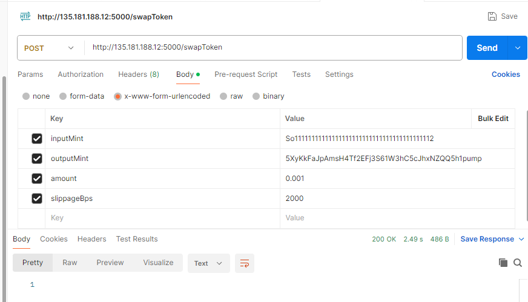

# Jupiter SWAP API using Jito Bundle

## Environment Variables

To run this project, you will need to add the following environment variables to your .env file

```
QUIKNODE_RPC = "https://example.solana-mainnet.quiknode.pro/..."
JITO_RPC_URL = "https://mainnet.block-engine.jito.wtf/api/v1/bundle"
JUPITER_V6_API = "https://quote-api.jup.ag/v6"
PRIVATE_KEY = "YOUR WALLET PRIVATE KEY HERE"
```

## Run Locally

Clone the project

```bash
  git clone https://github.com/axioris/jupiter-swap-api.git
```

Go to the project directory

```bash
  cd jupiter-swap-api
```

Install dependencies

```bash
  npm install
```

Start the server

```bash
  npm run dev

  or

  yarn dev

```

## API Reference

#### SWAP Token

POST ```http://localhost:5000/swapToken```

| Parameter | Type     | Example                |
| :-------- | :------- | :------------------------- |
| `inputMint` | `string` |  So11111111111111111111111111111111111111112 |
| `outputMint` | `string` | 5XyKkFaJpAmsH4Tf2EFj3S61W3hC5cJhxNZQQ5h1pump |
| `amount` | `number` | 0.001 |
| `slippageBps` | `number` | 2000 |



## Tech Stack

Node, Express, TypeScript, Jupiter, Jito_Bundle, @solana/web3


## Feedback

If you have any feedback, please reach out to us at [dane.foster.collins@gmail.com](mailto:dane.foster.collins@gmail.com) or open an issue on our [GitHub repository](https://github.com/axioris/jupiter-swap-api/issues).

## Contact

For any questions or support, please open an issue or contact me.
<p align="left">
 <a href="mailto:dane.foster.collins@gmail.com"></a>
 <a href="https://www.linkedin.com/in/dane-foster-11a177341/"></a>
 <a href="https://twitter.com/danefoster0"></a>
 <a href="https://t.me/danefoster"></a>
 <a href="https://discord.com/users/354781324558467073"></a>
</p>
